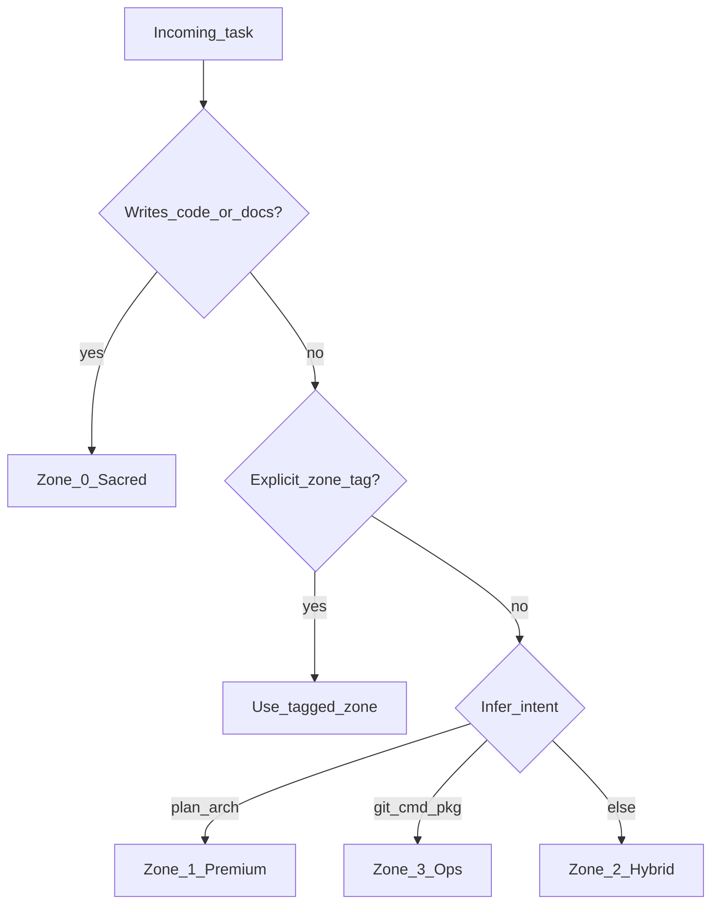

# AI Opt Runtime Spec — Zone & Diet Protocol v1.0

Canonical instruction contract for coding agents. Soft enforcement: hosts that honor workspace rules apply these behaviors.

## Diet levels

| Level | Chat / progress | Code / docs / tests |
|-------|-----------------|---------------------|
| `off` | Normal | Normal |
| `lite` | Compressed | Full precision |
| `on` (default) | Answer-first, dense | Full precision |
| `ultra` | Telegraphic | Full precision (never telegraph) |

## Zones (priority `0 > 1 > 2 > 3`)

| Zone | Name | When | Style |
|------|------|------|-------|
| 0 | Sacred | Writing code, docs, comments, docstrings | Full quality |
| 1 | Premium | `[PLAN]` `[ARCH]` design / PRD | Full depth, Mermaid OK |
| 2 | Hybrid | Default Q&A / debug | Compress analysis; clear answer |
| 3 | Ops | `[CMD]` `[GIT]` `[PKG]` `[QUICK]` `!fast` | Terse |

### Decision tree

### Anti-corruption

If an ops-tagged task must write source or docs, Zone 0 wins.

## Context packing

1. Search / path before broad reads.
2. Prefer line ranges and symbols over full files.
3. Batch independent tools.
4. Exclude ignore-boundary paths unless required.
5. At ~60–75% context, compact or hand off to a fresh session.

## Overrides

- `!verbose` — force richer chat
- `!code` / writes — force Zone 0
- `!fast` — force Zone 3 for ops-only replies
