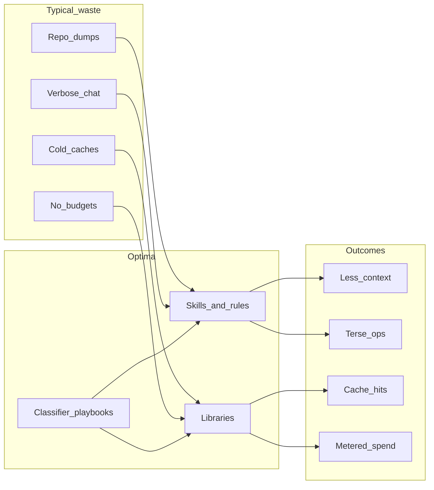
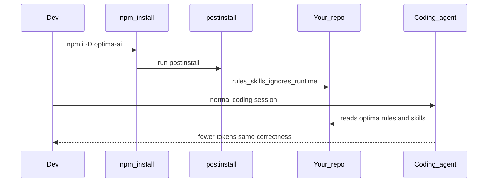
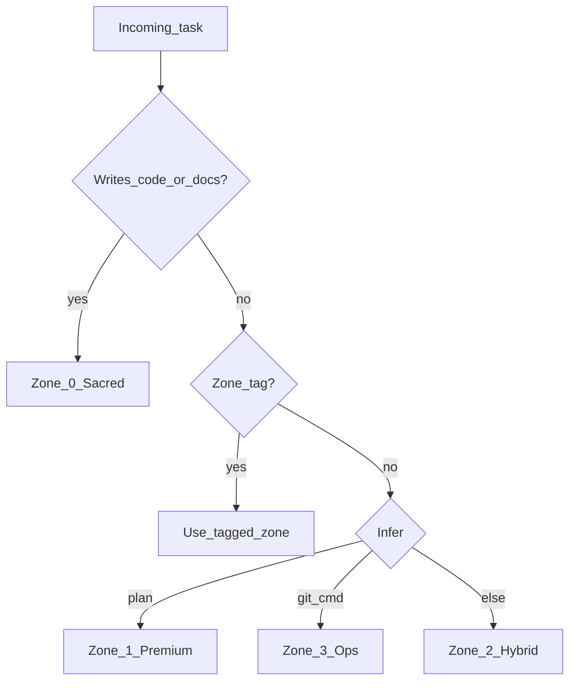
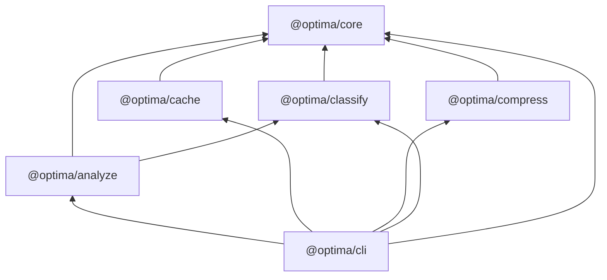

# Optima

**The optimization layer for AI coding agents and LLM apps.**

Install Optima into any repository the same way you’d install a package — your Cursor / Claude Code / Codex / Windsurf agents immediately get token-efficient behavior, context hygiene, and FinOps guardrails. Use the TypeScript packages when you need metering, compression, and cache-aware prompts in application code.

[](https://github.com/julienlhk/optima/actions/workflows/ci.yml)
[](./LICENSE)
[](./package.json)

---

## Why Optima exists

AI agents waste money and context on three things:

1. **Noise in** — lockfiles, `node_modules`, full-repo dumps, re-reads
2. **Noise out** — long preambles, verbose git/npm narration, duplicate explanations
3. **Bad loops** — thin prompts → 20 tool calls, retry spam, no budgets, cold prompt caches

Optima attacks all three with a **skill + rules pack** (for agents) and **importable libraries** (for apps).



---

## Install into a repo (like a package)

> The npm name `optima` is **taken**. Our package is **`optima-ai`** (CLI binary: `optima`).

| Channel | Command |
|---------|---------|
| **npm / pnpm / yarn** | `npm i -D optima-ai` ← postinstall wires skills into the project |
| **npx** | `npx optima-ai init --host all` |
| **GitHub** | `npx github:julienlhk/optima init` |
| **Skills CLI** | `npx skills add julienlhk/optima` |
| **Global** | `npm i -g optima-ai` then `optima init` |
| **Brew** | `brew install julienlhk/tap/optima` *(after tap publish)* |

Full details: [docs/install.md](./docs/install.md)

### npm (recommended)

```bash
cd your-app
npm install -D optima-ai
# skills + rules land in your project automatically
npx optima doctor
```

Skip auto-wiring: `OPTIMA_SKIP_POSTINSTALL=1 npm i -D optima-ai` then `npx optima init` when ready.

### What gets installed

| Artifact | Purpose |
|----------|---------|
| `.cursor/rules/optima.mdc` | Always-on Cursor rule (diet + zones + context hygiene) |
| `.cursor/skills/optima/` | On-demand Cursor skill |
| `.claude/skills/optima/` | Claude Code skill |
| `AGENTS.md` / `CLAUDE.md` blocks | Codex / Claude project instructions |
| `.cursorignore` (+ siblings) | Keep lockfiles/build noise out of context |
| `OPTIMA_RUNTIME.md` | Full zone + diet protocol (canonical) |



### From a local clone

```bash
git clone https://github.com/julienlhk/optima.git
cd optima && pnpm install && pnpm build
cd /path/to/your-app
npx /path/to/optima init --host all
```

---

## Quick start (this monorepo)

```bash
pnpm install
pnpm build
pnpm test

pnpm optima init --host all
pnpm optima doctor
pnpm optima estimate --file README.md --model claude-sonnet-4
pnpm optima classify README.md
pnpm optima bench
pnpm optima taxonomy
```

### Use as libraries

```ts
import { TokenMeter, estimateTokens } from "@optima/core";
import { classify } from "@optima/classify";
import { buildCacheableMessages } from "@optima/cache";
import { compressAuto } from "@optima/compress";
import { analyzeSessions, discoverSessions } from "@optima/analyze";

const meter = new TokenMeter("claude-sonnet-4", { softUsd: 0.05, hardUsd: 1 });
meter.record({ inputTokens: 1200, outputTokens: 300, cacheReadTokens: 800 });
```

---

## What Optima optimizes

| Layer | Problem | Optima lever | Package / skill |
|-------|---------|--------------|-----------------|
| **Input / context** | Agents swallow noise & whole files | Ignores, surgical reads, progressive disclosure, 60–75% compact | skills + `compress` |
| **Output** | Chatty ops replies burn output tokens | Diet levels + 4-zone routing | rules / `OPTIMA_RUNTIME.md` |
| **Cache** | Unstable prefixes → 0% cache hits | Stable-prefix builders + lint | `@optima/cache` |
| **Model routing** | Strong model does cheap explore | Cheap explore / strong verify playbook | `@optima/classify` |
| **Session loop** | Tool ping-pong & retries | Turn min, batching, waste heuristics | `@optima/analyze` |
| **FinOps** | No spend ceiling | Soft/hard token & USD meters | `@optima/core` |
| **Quality floor** | “Save tokens” breaks code/docs | Sacred zone — never telegraph source | all policies |

### Diet levels

| Level | Chat / progress | Code · docs · tests |
|-------|-----------------|---------------------|
| `off` | Normal | Normal |
| `lite` | Compressed | Full precision |
| `on` (default) | Answer-first, dense | Full precision |
| `ultra` | Telegraphic | **Still full precision** |

### Output zones

| Zone | Name | When | Style |
|------|------|------|-------|
| 0 | Sacred | Writing code / docs | Full quality — never compress meaning |
| 1 | Premium | `[PLAN]` `[ARCH]` design | Full depth, Mermaid OK |
| 2 | Hybrid | Default Q&A | Compress analysis, clear answer |
| 3 | Ops | `[GIT]` `[CMD]` `[PKG]` | Terse operational replies |



---

## Compared to common approaches

| Approach | Install | Enforcement | Libraries | Taxonomy | Enterprise docs | Best for |
|----------|---------|-------------|-----------|----------|-----------------|----------|
| **Optima** | `npx` / skills add | Soft rules + hard meters in apps | Yes (`@optima/*`) | 20 techniques / 7 layers | Yes | Teams that want one stack |
| Prompt-only “diet” packs | curl / paste | Soft only | No | Informal | Rare | Solo experiments |
| Ignore-file FinOps packs | Script | Soft only | No | Zones only | Light | Quick workspace hygiene |
| Heavy local hook interceptors | npm global | Hard (hooks) | Tooling-heavy | Implicit | Varies | Power users (check license) |
| Transcript rule generators | Python CLI | Soft rules | Analyzer only | Heuristics | Light | Cursor forensics only |

Optima’s bet: **skills for agents + libraries for apps + one taxonomy** so coaching, CI, and runtime share vocabulary.

---

## Packages

| Package | Role |
|---------|------|
| `@optima/core` | Token estimate, budgets, cost tables, zones/diet types |
| `@optima/classify` | Optimization taxonomy + playbook classifier |
| `@optima/compress` | Deterministic JSON / test / git compressors |
| `@optima/cache` | Cache-aware message builders + prefix lint |
| `@optima/analyze` | Cursor transcript waste scoring → tailored rules |
| `@optima/cli` | `optima` full CLI |



---

## CLI reference

| Command | What it does |
|---------|----------------|
| `optima init --host all` | Install rules, skills, ignores, runtime into cwd |
| `optima doctor` | Verify install health |
| `optima analyze` | Score local Cursor transcripts for waste |
| `optima analyze --apply-rules` | Write tailored `.cursor/rules` bullets |
| `optima classify <file\|->` | Recommend techniques / playbook from text |
| `optima estimate --file X --model M` | Rough token + USD estimate |
| `optima bench` | Honest micro-bench (not a marketing claim) |
| `optima taxonomy` | Dump the full technique catalog as JSON |

---

## Host support

| Host | Always-on | On-demand skill | Ignores |
|------|-----------|-----------------|---------|
| Cursor | `.cursor/rules/optima.mdc` | `.cursor/skills/*` | `.cursorignore` |
| Claude Code | `CLAUDE.md` block | `.claude/skills/*` | `.claudeignore` |
| Codex | `AGENTS.md` block | via skills CLI | `.codexignore` |
| Windsurf | `.windsurf/rules/optima.md` | — | shared template |

---

## Honest expectations

| Claim type | What we ship |
|------------|--------------|
| **Behavioral savings** | Rules/skills reduce verbosity & context when the model complies |
| **Measured in-app** | `TokenMeter`, compressors, cache builders — you instrument and prove |
| **Not claimed** | A single universal “−X% bill” for every team |

Reproduce micro-benches: `pnpm optima bench` and [benchmarks/RESULTS.md](./benchmarks/RESULTS.md).

---

## Documentation

| Doc | Contents |
|-----|----------|
| [Install](./docs/install.md) | npm / npx / git / brew channels |
| [Architecture](./docs/architecture.md) | System diagrams, install & analyze flows |
| [Taxonomy](./docs/taxonomy.md) | 7 layers, technique cards |
| [Adopting](./docs/adopting.md) | Greenfield vs brownfield rollout |
| [Security](./docs/security.md) | Local-by-default, no telemetry |
| [Compliance](./docs/compliance.md) | MIT, redistribution |
| [ADRs](./docs/adr/) | Design decisions |
| [API](./docs/api/README.md) | Import map |

---

## License

MIT — see [LICENSE](./LICENSE).
