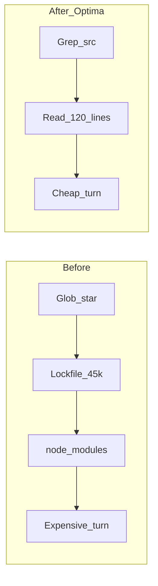
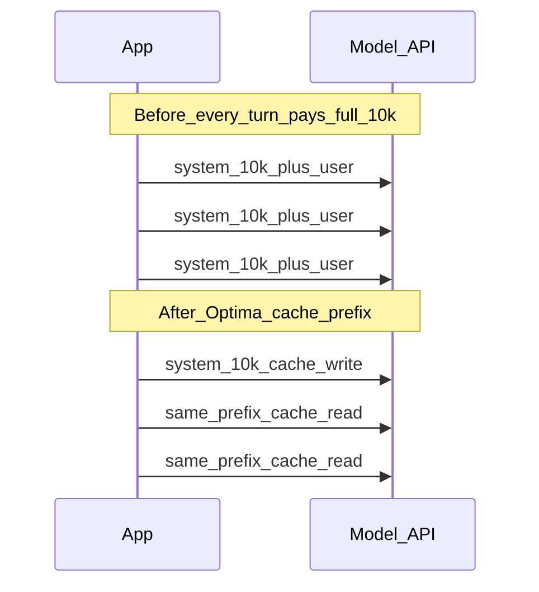
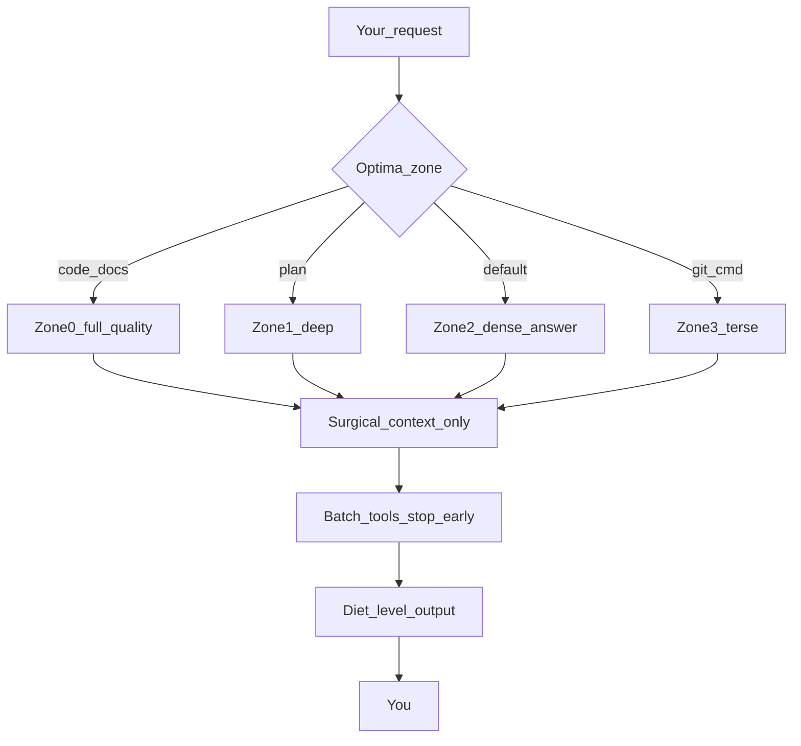

# Optima

**The optimization layer for AI coding agents and LLM apps.**

Install it into a repo → agents waste fewer tokens. Use the libraries in your app → you meter, cache, and compress for real.

[](https://github.com/julienlhk/optima/actions/workflows/ci.yml)
[](./LICENSE)
[](./package.json)

Costs below use **Claude Sonnet-class list prices** from Optima’s catalog: **$3 / 1M input**, **$15 / 1M output**, **$0.30 / 1M cache read**. Your bill depends on model, workload, and whether the agent follows the rules.

### Start with any AI agent

Paste this repo into Cursor, Claude, Codex, or any coding agent and ask it to adopt Optima:

> Install and adapt [https://github.com/julienlhk/optima](https://github.com/julienlhk/optima) (or `npm i -D optima-ai`) into this project, wire the skills/rules, and keep using Optima by default for token-efficient work.

The agent should install the package, run `npx optima init`, and follow the always-on rules/skills from then on — you don’t need a separate manual setup ritual.

---

## What changes for you (before → after)

### 1) Stop paying to read junk

**Before (no Optima):** agent globs the repo and reads lockfiles / `node_modules` noise.

```text
User: fix the auth bug

Agent tools:
  Glob  **/*
  Read  pnpm-lock.yaml          (~45k tokens)
  Read  node_modules/.../index.js
  Read  dist/bundle.js
```

**After (Optima ignores + surgical reads):**

```text
User: fix the auth bug

Agent tools:
  Grep  "login" path=src/auth
  Read  src/auth/session.ts:1-120
```

| | Tokens into model | Cost (input) | What you feel |
|--|-------------------|--------------|----------------|
| **Before** | ~80,000 noise + task | **~$0.240** | Slow, confused, expensive turn |
| **After** | ~2,000 relevant | **~$0.006** | Same bug, 40× cheaper context |
| **Delta** | −78,000 | **−$0.234 (−97%)** | |



---

### 2) Stop paying for chatty ops replies

**Before:**

```text
User: [GIT] status

Agent: Sure! I'd be happy to help you check the git status of your
repository. Let me run that command and walk you through what each
file means in detail so you have full context for your next steps...
(continues for ~600 tokens)
```

**After (Zone 3 Ops + diet `on`):**

```text
User: [GIT] status

Agent: M src/auth/session.ts
  ?? src/auth/session.test.ts
  branch main…origin/main
```

| | Output tokens | Cost (output) |
|--|---------------|---------------|
| **Before** | ~600 | **~$0.0090** |
| **After** | ~60 | **~$0.0009** |
| **Delta** | −540 | **−$0.0081 (−90%)** |

Code and docs stay **Zone 0 Sacred** — never telegraphed. Only chat/ops get compressed.

---

### 3) Prompt caching: same system prompt, ~10× cheaper on repeat

**Before (no cache discipline):** every API turn resends a 10,000-token system prompt at full input price.

**After (`@optima/cache` stable prefix + `cache_control`):** first turn writes cache; later turns read at cache-read price.

| | 100 turns / day · 10k system tokens each | Daily cost (system only) |
|--|------------------------------------------|---------------------------|
| **Before** (always full input) | 100 × 10k × $3/1M | **~$3.00** |
| **After** (1 cache write + 99 cache reads) | write ~$0.04 + reads ~$0.30 | **~$0.34** |
| **Delta** | | **−$2.66 / day (−89%)** |



**Prompt shape Optima enforces:**

```ts
// Stable first (cacheable) → variable last
buildCacheableMessages({
  system: POLICY_AND_TOOLS,      // unchanged across turns
  toolsSchema: TOOL_JSON,        // unchanged
  user: `Order ${orderId}?`,     // only this moves
});
```

**Cache-busting Optima lints (these destroy savings):**

```diff
- system: `You are support. Time: 2026-09-17T22:00:00Z`  // timestamp in prefix
+ system: `You are support.`                             // stable
+ user:   `Time: 2026-09-17T22:00:00Z\nOrder ${id}?`     // variable in user turn
```

---

### 4) Compress tool noise before the model sees it

**Before:** paste full test log into the next turn (~20,000 tokens of green checkmarks).

**After (`compressAuto(log, "test")`):** keep failures + summary; drop pass spam.

```text
Before (excerpt):
  ✓ unit a
  ✓ unit b
  … 180 more passes …
  FAIL refund_policy
  AssertionError: expected 200

After (Optima compress):
  [optima] suppressed 182 passing assertion lines
  FAIL refund_policy
  AssertionError: expected 200
  Tests: 1 failed, 182 passed
```

| | Tokens fed back to model | Cost (input) |
|--|--------------------------|--------------|
| **Before** | ~20,000 | **~$0.060** |
| **After** | ~1,200 | **~$0.004** |
| **Delta** | −18,800 | **−$0.056 (−93%)** |

---

### 5) One coding session — stacked effect

Illustrative **40-turn** Cursor session (Sonnet-class pricing):

| Cost bucket | Before Optima | After Optima | Change |
|-------------|---------------|--------------|--------|
| Context / file reads | $1.80 | $0.35 | −81% |
| Tool-output re-ingest | $0.45 | $0.06 | −87% |
| Chatty agent output | $0.60 | $0.18 | −70% |
| Retries / vague explore | $0.40 | $0.10 | −75% |
| **Session total** | **~$3.25** | **~$0.69** | **≈ −79%** |

```mermaid
%%{init: {'themeVariables': {'xyChart': {'plotColorPalette': '#c45c26, #2f6f4e'}}}}%%
xychart-beta
  title "Illustrative session cost USD"
  x-axis ["Context", "Tool_logs", "Chat_out", "Retries", "Total"]
  y-axis "USD" 0 --> 3.5
  bar [1.80, 0.45, 0.60, 0.40, 3.25]
  bar [0.35, 0.06, 0.18, 0.10, 0.69]
```



Agent-layer rows assume the model **follows** Optima rules. Library rows (cache, compress, meters) are **deterministic** when you call them in code.

---

## How a turn flows



| You type | Optima does |
|----------|-------------|
| “fix auth” | Grep/read `src/…`, not lockfiles; answer-first |
| `[GIT] status` | Terse ops reply |
| `[PLAN] redesign billing` | Full depth + Mermaid OK |
| API app with long system prompt | Stable prefix + cache breakpoints |
| Huge pytest log in the loop | Compress → failures only |

---

## Install

```bash
npm install -D optima-ai
```

That installs the package and wires Optima skills/rules into your project. Then:

```bash
npx optima doctor
npx optima debug
npx optima bench
npx optima estimate --file README.md --model claude-sonnet-4
```

| Command | What it does |
|---------|----------------|
| `npm i -D optima-ai` | Install + auto-wire skills/rules/ignores |
| `npx optima init` | Re-run wiring (optional `--host cursor`) |
| `npx optima doctor` | Verify install |
| `npx optima debug` | Structured debug probe + worksheet (`--problem` / `--write`) |
| `npx optima analyze` | Score Cursor transcripts |
| `npx optima classify <file>` | Recommend techniques |
| `npx optima estimate --file X` | Token + USD estimate |
| `npx optima bench` | Micro-bench |
| `npx optima taxonomy` | Technique catalog |
| `npx optima help` | Help |

Global (optional): `npm i -g optima-ai` → run `optima` on your PATH.

| Artifact | Purpose |
|----------|---------|
| `.cursor/rules/optima.mdc` | Always-on Cursor rule |
| `.cursor/skills/optima/` | Cursor skill |
| `.claude/skills/optima/` | Claude skill |
| `AGENTS.md` / `CLAUDE.md` | Host instructions |
| `.cursorignore` (+ siblings) | Keep junk out of context |
| `OPTIMA_RUNTIME.md` | Full diet + zone protocol |

More: [docs/install.md](./docs/install.md)

### Privacy

Optima does **not** store or upload your code. No accounts, no telemetry, no Optima servers. Install only writes files into **your** project. Details: [docs/security.md](./docs/security.md).

### Debugging

When something fails, don’t guess a fix first:

```bash
npx optima debug --problem "skills not applying" --write
```

That prints a local probe and a worksheet: **5–7 hypotheses → rank 1–2 → validate with logs → then fix.** Agent skill: `optima-debug`.

---

## Quick start (this monorepo)

```bash
pnpm install && pnpm build && pnpm test
pnpm optima init --host all
pnpm optima estimate --file README.md --model claude-sonnet-4
pnpm optima bench
```

```ts
import { TokenMeter } from "@optima/core";
import { buildCacheableMessages } from "@optima/cache";
import { compressAuto } from "@optima/compress";

const meter = new TokenMeter("claude-sonnet-4", { softUsd: 0.05, hardUsd: 1 });
meter.record({ inputTokens: 1200, outputTokens: 300, cacheReadTokens: 800 });

const msgs = buildCacheableMessages({
  system: LONG_STABLE_POLICY,
  user: "Where is order 1234?",
});
const slim = compressAuto(hugeTestLog, "test");
```

---

## Levers (cheat sheet)

| Layer | Problem | Optima change |
|-------|---------|---------------|
| **Input** | Repo dumps, lockfiles | Ignores + surgical reads |
| **Output** | Chatty git/npm replies | Diet + zones |
| **Cache** | Resending the same system prompt | Stable prefix + breakpoints |
| **Tools** | Huge logs re-ingested | `compressAuto` |
| **FinOps** | No ceiling | `TokenMeter` soft/hard limits |
| **Quality** | “Cheap” broken code | Sacred zone for source/docs |

### Diet levels

| Level | Chat | Code / docs / tests |
|-------|------|---------------------|
| `off` | Normal | Normal |
| `lite` | Compressed | Full precision |
| `on` (default) | Answer-first | Full precision |
| `ultra` | Telegraphic | Full precision |

### Zones

| Zone | When | Style |
|------|------|-------|
| 0 Sacred | Writing code/docs | Full quality |
| 1 Premium | `[PLAN]` / `[ARCH]` | Full depth |
| 2 Hybrid | Default Q&A | Dense answer |
| 3 Ops | `[GIT]` / `[CMD]` / `[PKG]` | Terse |

---

## Libraries (from this monorepo)

When developing against the Optima repo locally:

| Package | Role |
|---------|------|
| `@optima/core` | Tokens, budgets, cost tables |
| `@optima/classify` | Technique playbooks |
| `@optima/compress` | JSON / test / git compressors |
| `@optima/cache` | Cache-aware prompts + lint |
| `@optima/analyze` | Cursor transcript waste → rules |

App usage after `npm i -D optima-ai` is via the **`optima` CLI** above (skills + analyze/estimate/bench).

---

## Docs

| Doc | Contents |
|-----|----------|
| [Install](./docs/install.md) | npm / npx / git / brew |
| [Architecture](./docs/architecture.md) | System diagrams |
| [Taxonomy](./docs/taxonomy.md) | 7 layers |
| [Adopting](./docs/adopting.md) | Rollout |
| [Security](./docs/security.md) | Local-by-default |
| [Compliance](./docs/compliance.md) | MIT |
| [API](./docs/api/README.md) | Import map |

## License

MIT — see [LICENSE](./LICENSE).
