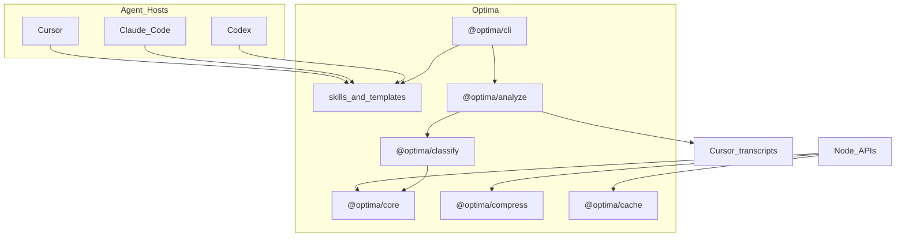
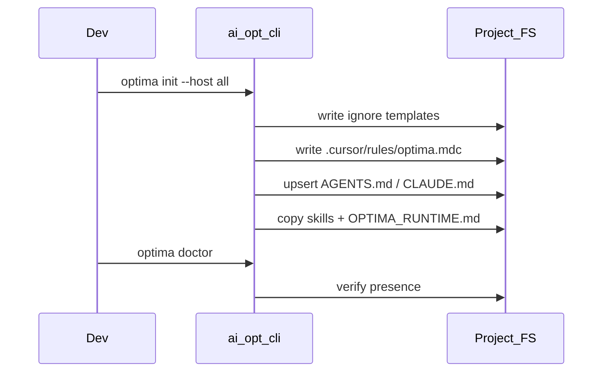
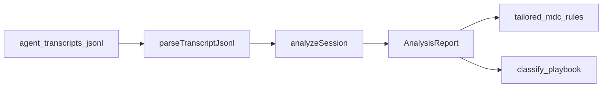
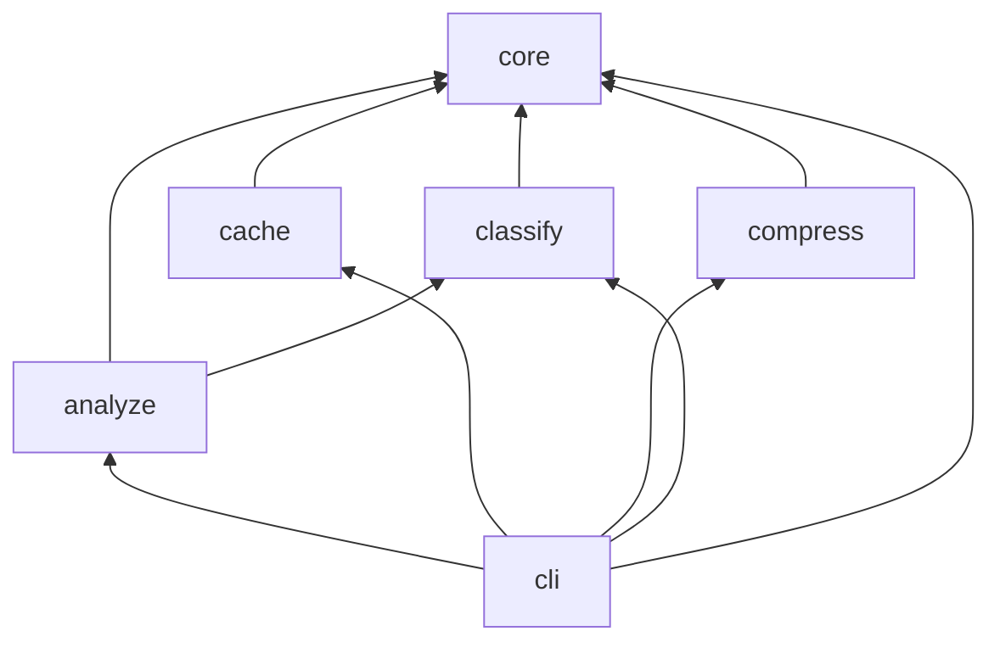

# Architecture

## System context

## Install flow

## Analyze loop

## Package dependency DAG

## Design principles

1. **Libraries first** — measurable APIs before soft policy.
2. **Sacred quality floor** — never trade correctness for tokens.
3. **Honest evidence** — mark techniques measured vs behavioral vs estimated.
4. **Local-by-default** — analyze transcripts on disk; no telemetry.
5. **Clean-room legality** — MIT only; no vendoring of Noncommercial upstream.
