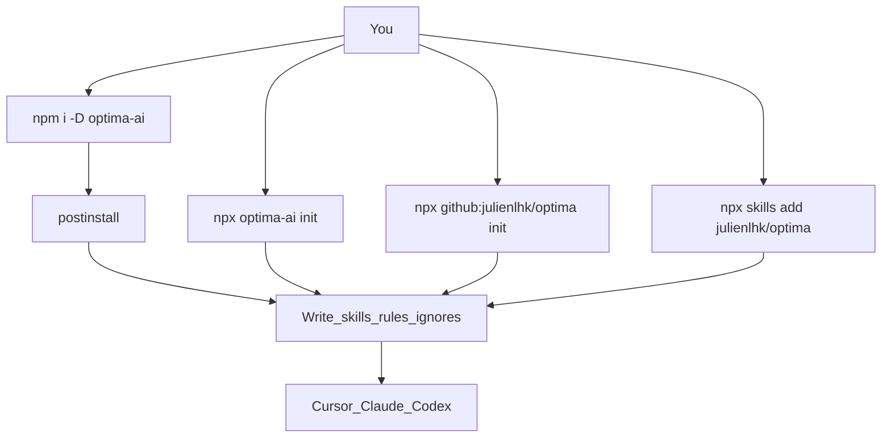

# Install Optima

Optima is meant to feel like a normal package: install it, and your project’s AI agents get the skillset.

**Package:** `optima-ai` · **CLI:** `optima`

---

## Channels

| Channel | Command | What happens |
|---------|---------|----------------|
| **npm / pnpm / yarn** | `npm i -D optima-ai` | Package in `node_modules` + **postinstall** copies skills/rules into the project |
| **npx (no dependency)** | `npx optima-ai init` | One-shot wiring, nothing added to package.json |
| **GitHub (no registry)** | `npx github:julienlhk/optima init` | Same installer, from git |
| **Skills CLI** | `npx skills add julienlhk/optima` | Agent-skills format install |
| **Global CLI** | `npm i -g optima-ai` then `optima init` | Binary on PATH |
| **Brew** | `brew install julienlhk/tap/optima` *(after tap publish)* | Wraps the same Node CLI |
| **From source** | clone → `pnpm i && pnpm build` → `optima init` | Full monorepo + libraries |



---

## Recommended: npm dependency

```bash
cd your-app
npm install -D optima-ai
# or:  pnpm add -D optima-ai
# or:  yarn add -D optima-ai
```

On install, Optima’s `postinstall` writes into **your project**:

| Path | Role |
|------|------|
| `.cursor/rules/optima.mdc` | Always-on agent rules |
| `.cursor/skills/optima/` | Cursor skill |
| `.claude/skills/optima/` | Claude skill |
| `AGENTS.md` / `CLAUDE.md` | Host instructions |
| `.cursorignore` … | Context boundaries |
| `OPTIMA_RUNTIME.md` | Full protocol |

Commit those files so the whole team shares the same agent FinOps.

### Skip / customize postinstall

```bash
OPTIMA_SKIP_POSTINSTALL=1 npm i -D optima-ai   # install package only
OPTIMA_HOST=cursor npm i -D optima-ai           # Cursor-only wiring
npx optima init --host all                      # run wiring manually
```

---

## Publishing (maintainers)

```bash
pnpm install && pnpm build
npm publish --access public
```

After publish:

```bash
npm i -D optima-ai
```
