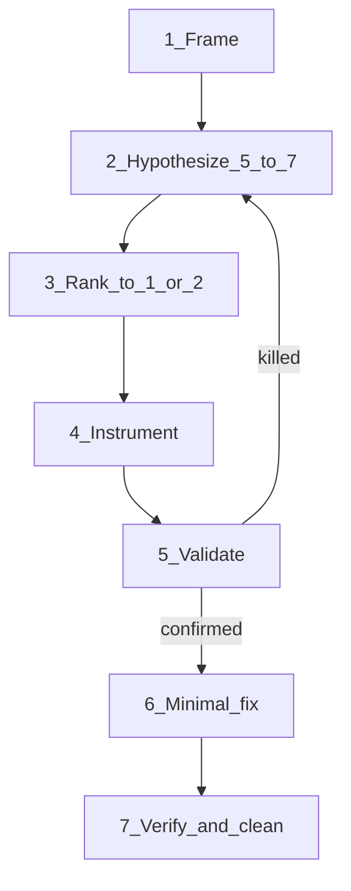

# Optima Debug

## Hard rule

**No code fix until a hypothesis is confirmed by evidence.**  
Jumping to a patch is a failure of this skill.

## Order (do not skip)

```text
Frame → Hypothesize (5–7) → Rank (1–2) → Instrument → Validate → Fix → Verify
```



---

### 1) Frame (3 lines max)

| Field | Value |
|-------|-------|
| **Symptom** | Exact observation (error text, wrong output, missing path) |
| **Expected** | What should happen |
| **Scope** | Command / host / env / after which change |

Bootstrap with a local probe (no network):

```bash
npx optima debug
npx optima debug --problem "<one-line symptom>"
npx optima debug --write   # optional: OPTIMA_DEBUG.md in the project only
```

---

### 2) Hypothesize 5–7 sources

Use **different categories** — not 7 flavors of the same guess:

| # | Category | Starter prompt |
|---|----------|----------------|
| 1 | **Install / wiring** | Skills/rules never landed here |
| 2 | **Host / agent** | Cursor/Claude not loading always-on rules |
| 3 | **Config / env** | `OPTIMA_SKIP_POSTINSTALL`, wrong cwd, wrong `--host` |
| 4 | **Version / path** | Stale `optima-ai`, wrong bin, monorepo vs npm |
| 5 | **Context / ignores** | Needed file excluded by ignore boundaries |
| 6 | **Logic / code** | Bug in compressor, meter, classifier, installer |
| 7 | **External** | Permissions, sandbox EPERM, provider API |

Each hypothesis must be falsifiable:

> **If** \<cause\> **were true, we would see** \<observable\>.

---

### 3) Distill to 1–2 most likely

| Rank | Hypothesis | Why likely now | Fast disproof |
|------|------------|----------------|---------------|
| H1 | | | One command / log that kills it |
| H2 | | | One command / log that kills it |

Park the rest. Do not investigate all seven.

---

### 4) Instrument before fixing

Add the **smallest** checks that distinguish H1 vs H2:

| Prefer | Avoid |
|--------|-------|
| `npx optima doctor` / `npx optima debug` | Spray `console.log` everywhere |
| File exists + version + env dump | Logging secrets / full prompts |
| One boundary log (in → out) | Remote logging / telemetry |

Logs stay on **local stdout** (or `--write` into the project). Never send elsewhere.

---

### 5) Validate

| Evidence | Action |
|----------|--------|
| Confirms H1/H2 | Proceed to minimal fix |
| Kills H1/H2 | Promote next candidate — do **not** fix anyway |
| Ambiguous | One tighter log; still no speculative rewrite |

---

### 6) Fix

- Smallest change for the **validated** cause only
- No drive-by refactors in the same pass

### 7) Verify + clean

- Re-run the failing repro
- Remove temporary debug logs
- One-line root cause note

---

## Agent output template (fill before coding)

```markdown
### Frame
- Symptom:
- Expected:
- Scope:

### Hypotheses (5–7)
1. [install] If …, we would see …
2. [host] If …, we would see …
3. [config] If …, we would see …
4. [version] If …, we would see …
5. [context] If …, we would see …
6. [logic] If …, we would see …
7. [external] If …, we would see …

### Rank
- H1: … | disproof: …
- H2: … | disproof: …

### Evidence gathered
- …

### Confirmed cause
- …

### Fix plan (only after confirmation)
- …
```

---

## Anti-patterns

| Don’t | Do |
|-------|-----|
| Rewrite on the first idea | Rank, then disprove |
| Add dozens of logs | 2–3 discriminating checks |
| Fix two unrelated things | One validated cause |
| Blame the model with no proof | `doctor` / install / paths first |

## Privacy

This skill and `optima debug` run **locally only**. No accounts, no Optima servers, no telemetry. Optional `--write` only creates `OPTIMA_DEBUG.md` in **your** project.
