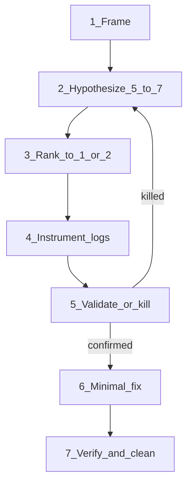

# Optima Debug

## Overview

Do **not** jump to a code fix. Use this protocol so you spend tokens on the right cause.

## When to use

- Bug, flake, regression, install failure, agent ignoring Optima rules
- User says “debug this” / “why doesn’t it work”
- Fix attempts keep missing

## Protocol (mandatory order)



### 1) Frame (3 bullets max)

| Field | Fill in |
|-------|---------|
| **Symptom** | What you observe (error text, wrong output, missing file) |
| **Expected** | What should happen |
| **Scope** | When / where (command, host, env, after which change) |

### 2) Hypothesize 5–7 sources

Cover **different categories** — do not list 7 variants of the same guess:

| # | Category | Example hypothesis |
|---|----------|-------------------|
| 1 | **Install / wiring** | Skills/rules never landed in this project |
| 2 | **Host / agent** | Cursor/Claude not loading always-on rules |
| 3 | **Config / env** | `OPTIMA_SKIP_POSTINSTALL`, wrong cwd, wrong host flag |
| 4 | **Version / path** | Stale `optima-ai@1.0.0`, wrong bin, monorepo vs npm |
| 5 | **Context / ignores** | Needed file excluded by `.cursorignore` |
| 6 | **Logic / code** | Bug in compressor, meter, classifier, installer |
| 7 | **External** | Provider API, permissions, sandbox EPERM |

Write each as: *If X were true, we would see Y.*

### 3) Distill to 1–2 most likely

For each top candidate:

| Hypothesis | Why likely | Fast disproof |
|------------|------------|---------------|
| H1 | … | One command or log that kills it |
| H2 | … | One command or log that kills it |

Discard the rest **for now** (keep the list; don’t investigate all).

### 4) Instrument before fixing

Add the **smallest** logs/checks that distinguish H1 vs H2:

- Prefer existing: `npx optima doctor`, `npx optima debug`, file existence, versions
- If code: log inputs/outputs at the boundary (one function), not spray `console.log` everywhere
- Logs must be **local stdout** only — never send elsewhere

### 5) Validate

| Result | Action |
|--------|--------|
| Hypothesis confirmed | Proceed to minimal fix |
| Hypothesis killed | Promote next candidate; do not “fix anyway” |
| Ambiguous | One more precise log; still no speculative rewrite |

### 6) Fix

- Smallest change that addresses the **validated** cause
- Do not “clean up” unrelated code in the same pass

### 7) Verify + clean

- Re-run the failing command / repro
- Remove temporary debug logs
- Note what the real cause was (one line)

## Anti-patterns

| Don’t | Do |
|-------|-----|
| Rewrite a module on the first idea | Rank hypotheses first |
| Add 40 logs | 2–3 discriminating logs |
| Fix two unrelated things at once | One validated cause |
| Blame the model with no evidence | Check install + doctor first |

## Optima-specific quick checks

```bash
npx optima doctor
npx optima debug
npx optima debug --problem "skills not applying in Cursor"
```

## Verification checklist

- [ ] Symptom / expected / scope written
- [ ] ≥5 hypotheses across categories
- [ ] Top 1–2 ranked with disproofs
- [ ] Logs or doctor checks run **before** code fix
- [ ] Fix matches validated cause
- [ ] Temporary logs removed
